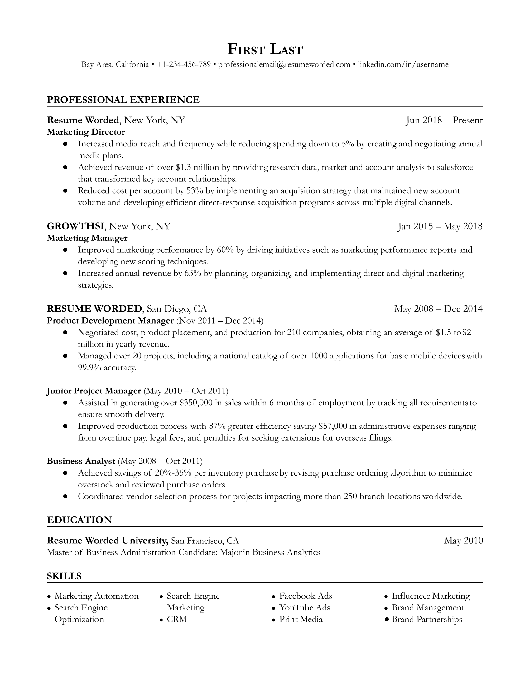

# **Resume/CV Builder** 🛠️

**Build Professional Résumés with Ease 🚀**

---

## 🌐 Try It Online

You can now use the **Resume/CV Builder** directly on the web!  

1. **[Download a sample template](samples/modern/)** to get started.
2. **Edit the file** with your details using any text editor.
3. **Visit [easyfreeresume.com](https://easyfreeresume.com)**, upload your template, and generate your resume instantly!

---

## 🎯 Project Goal

This tool simplifies the process of creating and updating resumes, so you can **focus on your content, not the formatting.**

### Key Benefits:
- **Effortless Updates**: Modify your resume by editing a single file.
- **Modern & Professional Designs**:
  - Select from sleek, ATS-compliant [templates](#templates).
  - Ensure consistent formatting across all versions.
- **ATS-Optimized**: Your resume will be fully scannable by Applicant Tracking Systems.
- **Customizable PDFs**: Add icons, hyperlinks, and logos for a visually appealing, industry-standard resume.

---

## 🛠️ How to Use (Step-by-Step Guide)

1. **[Download a Template](samples/modern/)**  
   Choose a sample template to get started.

2. **Add Your Details**  
   Open the file in any text editor (e.g., Notepad, Notepad++ (recommended) or VS Code) and fill in your personal details.

3. **Upload Your File**  
   Visit [easyfreeresume.com](https://easyfreeresume.com) to upload your template. Optionally, upload icons to personalize your resume.

4. **Generate Your Resume**  
   Click "Generate Resume" to instantly download your polished, ATS-friendly PDF resume.

For more advanced customization, check out the [YAML Template Guide](#yaml-template-guide).

---

## 📝 YAML Template Guide

Your resume data is stored in a structured text file (template). No coding required!

### **What Is a Template?**
A template is a simple text file where you add details about your experience, skills, and education.

### **Example Template**
Here’s how a skills section looks in the template:

```yaml
- name: Skills
  type: dynamic-column-list
  content:
    - Python
    - Data Analysis
    - Team Management
```

### **Supported Section Types**
| **Type**           | **Description**                                                                                       | **Example Usage**               |
|---------------------|-------------------------------------------------------------------------------------------------------|---------------------------------|
| `text`             | A simple text block for single-paragraph sections.                                                   | Summary, Objective              |
| `bulleted-list`    | A bulleted list format for multiple items.                                                            | Skills, Hobbies                 |
| `inline-list`      | A compact, single-line list without bullets.                                                         | Key Skills, Personal Interests  |
| `icon-list`        | A list with optional icons, often used for certifications or awards.                                  | Certifications                  |
| `dynamic-column-list` | Automatically adjusts columns for space efficiency.                                                  | Skills                          |
| `experience`       | Structured format for job experience, including company name, title, and dates.                      | Work History                    |
| `education`        | Structured format for academic qualifications.                                                       | Education                       |

### **Generic Section Example**
Customize sections with the following structure:

```yaml
- name: [Section Name]
  type: [Section Type] # Replace with a supported type (e.g., text, bulleted-list, experience)
  content:
    - Example Item 1
    - Example Item 2
```

For detailed guidance, visit the [full YAML guide](#supported-section-types).

---

## 🚀 Templates

<details>
  <summary>Expand to View Available Templates</summary>

### Modern (No Icons)
A clean, single-column layout without decorative icons.

**YAML Sample**:  
`template_path: samples/modern/john_doe_no_icon.yml`  

**Screenshot**:  


---

### Modern (With Icons)
A clean, single-column layout with decorative icons for sections like experience, education, and certifications.

**YAML Sample**:  
`template_path: samples/modern/john_doe.yml`  

**Screenshot**:  


</details>

<details>
  <summary>Expand to View Upcoming Templates</summary>

### Minimalist (Work in Progress)
A simple, no-frills design focused on clarity.

**Screenshot**:  


### Creative (Planned)
A bold, colorful design for showcasing creativity.

**YAML Sample**:  
`template_path: samples/creative_sample.yml`  
*(Coming Soon)*

</details>

---

## ✨ Features

- **Dynamic Templates**: Multiple ATS-friendly designs.
- **Flexible Customization**: Edit your resume in YAML format for structured content.
- **Icon and Logo Support**: Add a personal touch with icons.
- **Responsive Layouts**: Optimized for modern, clean formatting.
- **PDF Generation**: Download your resume as a polished PDF.

---

## ❓ Troubleshooting

### Why isn’t my resume generating?
- Ensure all required fields in the template are filled.
- Use the correct file format (`.yaml`).

### Can I add custom icons?
- Yes! Upload PNG, JPG, or SVG files along with your template.

### Need more help?  
Visit our [GitHub Issues](https://github.com/aafre/resume-builder/issues) page.

---

## Getting Started

### Quick Start Guide:

1. **Clone the repository**:  
   ```bash
   git clone https://github.com/aafre/resume-builder.git
   ```

2. **Navigate to the project directory**:  
   ```bash
   cd resume-builder
   ```

3. **Prepare your input**:  
   - Choose a sample template from the [templates](#templates) section.
   - Edit the `.yaml` file with your details.

4. **Generate your resume**:  
   Run the script to generate your PDF resume:

   ```bash
   python resume_generator.py --template modern --input data/sample.yml --output output/resume.pdf
   ```

---

## 🐳 Run Using Docker

1. **Build the Docker Image**:
   ```bash
   docker build -t resume-builder .
   ```

2. **Run the Container**:
   ```bash
   docker run -it --rm -v "${pwd}:/app/" resume-builder
   ```

3. **Generate Your Resume**:
   ```bash
   python resume_generator.py --template modern --input data/sample.yml --output output/resume.pdf
   ```

---

## 🛠️ Contributing

Contributions are welcome! Submit a pull request or report an issue to improve this project.


---
